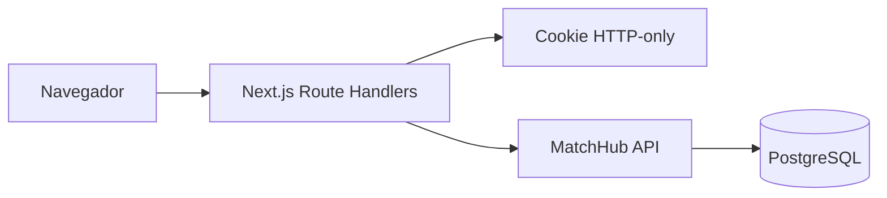

# MatchHub Dashboard

[](https://github.com/Kadys-dv/matchhub-dashboard/actions/workflows/ci.yml)
[](#stack)
[](#stack)
[](#stack)
[](https://matchhub-dashboard.vercel.app/)

Painel web administrativo da plataforma PlayMatch. Projeto independente que consome a `matchhub-api` por uma camada BFF, mantendo a sessão administrativa em cookie HTTP-only e sem expor o token da API ao JavaScript do navegador.


## Links rápidos

- Demo: <https://matchhub-dashboard.vercel.app/>
- Estudo de caso: <https://kadys-dv.github.io/portfolio-rodrigo/projetos/matchhub-dashboard.html>
- API consumida: <https://github.com/Kadys-dv/matchhub-api>
- Arquitetura: [docs/ARCHITECTURE.md](docs/ARCHITECTURE.md)

## Objetivo

A operação do PlayMatch precisa acompanhar partidas, atletas, denúncias e indicadores em uma interface única. Como essas ações são administrativas, o painel não pode tratar o navegador como ambiente confiável nem guardar tokens sensíveis em JavaScript.

## Solução

O dashboard usa Next.js como BFF: o navegador conversa com Route Handlers do próprio dashboard, e o servidor encaminha as chamadas para a MatchHub API. A sessão fica em cookie HTTP-only e a autorização definitiva continua no backend Java.



## Funcionalidades

- Autenticação administrativa via BFF com cookie HTTP-only.
- Indicadores operacionais em tempo real.
- Criação, conclusão, cancelamento e consulta de participantes das partidas.
- Busca e ativação/desativação de atletas.
- Fila de denúncias com resolução administrativa.
- Relatórios consolidados e navegação responsiva.
- Identidade visual PlayMatch com movimento 3D acessível.

## Stack

- Next.js 16
- React 19
- TypeScript
- Tailwind CSS 4
- Route Handlers como BFF
- Zod para validação de configuração e formulários
- Vitest, Testing Library e jsdom
- ESLint, TypeScript e build de produção
- Docker multi-stage e GitHub Actions

## Executar localmente

1. Mantenha a `matchhub-api` ativa em <http://localhost:8080>.
2. Copie `.env.example` para `.env.local` se precisar alterar a URL.
3. Instale as dependências:

```powershell
npm install
```

4. Rode o dashboard:

```powershell
npm run dev
```

5. Abra <http://localhost:3000>.

## Qualidade

```powershell
npm run check
npm run test:coverage
```

`npm run check` valida lint, tipos, testes e build de produção. `npm run test:coverage` gera o relatório em `coverage/index.html`. O workflow de CI executa essas validações e publica a cobertura como artefato.

## Segurança

- O token da API fica em cookie HTTP-only.
- Variáveis privadas permanecem somente no servidor.
- O navegador não recebe o token da API diretamente.
- O controle de autorização definitivo pertence à MatchHub API.

## Publicação

Importe o repositório na Vercel, mantenha o framework detectado como Next.js e configure `MATCHHUB_API_URL` com a URL HTTPS publicada da API, sem barra no final. O projeto não exige `vercel.json`; build, Route Handlers e runtime do servidor são detectados automaticamente.

Desenvolvido por Dev Rodrigo. Todos os direitos reservados.
