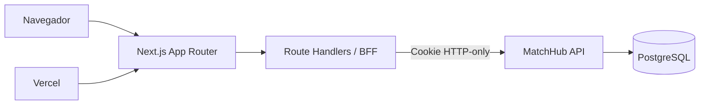

# Arquitetura do MatchHub Dashboard

O navegador não acessa o JWT diretamente. Os Route Handlers formam a fronteira BFF, encaminham respostas controladas e distinguem sessão expirada de indisponibilidade da API.
